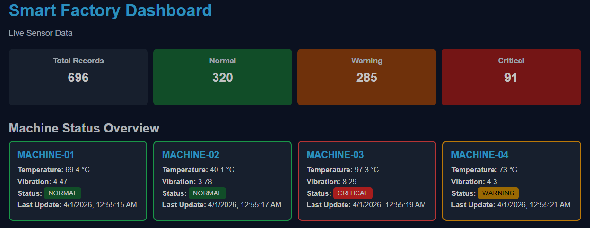
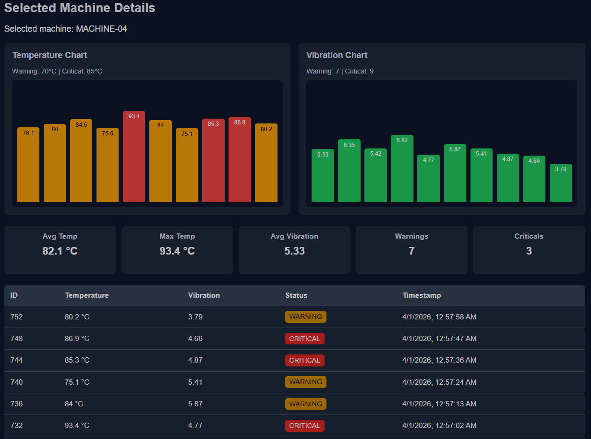
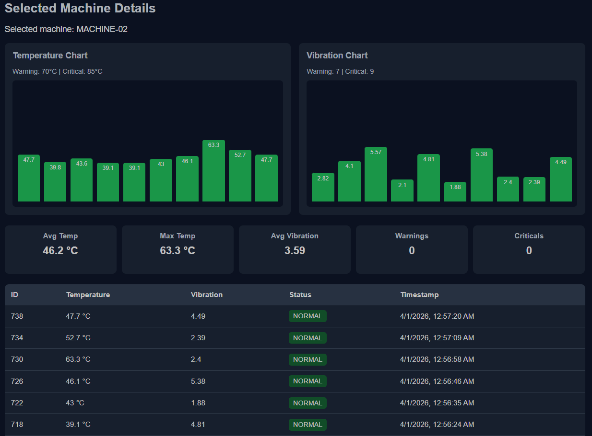
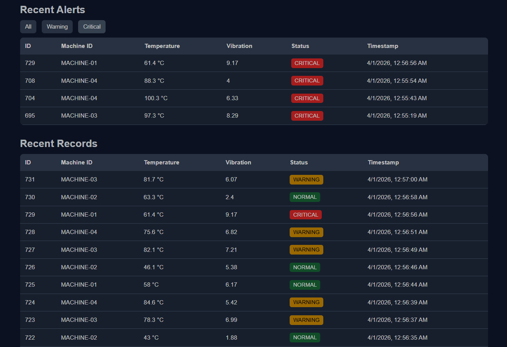

# Smart Factory Monitoring Dashboard

This project is a simple smart factory monitoring dashboard built for learning purposes.  
It simulates sensor data coming from factory machines, stores the data in a SQLite database, and shows the machine status on a web dashboard.

## Features

- Sensor data simulation for multiple factory machines
- FastAPI backend for receiving and serving sensor data
- SQLite database for storing machine records
- Status classification:
  - Normal
  - Warning
  - Critical
- Live web dashboard with:
  - summary cards
  - machine cards
  - recent records table
  - recent alerts filter
- Selected machine detail view
- Simple bar charts for temperature and vibration
- Machine statistics:
  - average temperature
  - max temperature
  - average vibration
  - warning count
  - critical count

## Technologies Used

- **Python**
- **FastAPI**
- **SQLite**
- **HTML**
- **CSS**
- **JavaScript**

## How It Works

- `sensor_simulator.py` generates sample machine data
- The backend receives and stores the data
- The frontend fetches data from the API
- The dashboard shows machine status and recent activity

## Screenshots

### Dashboard Overview

### Selected Machine Details

### Alerts View

## API Endpoints

- `GET /` → dashboard page
- `POST /api/sensor` → receive sensor data
- `GET /api/data` → recent records
- `GET /api/summary` → summary information
- `GET /api/machines/latest` → latest data for each machine
- `GET /api/alerts` → warning and critical alerts
- `GET /api/machine/{machine_id}` → selected machine records

